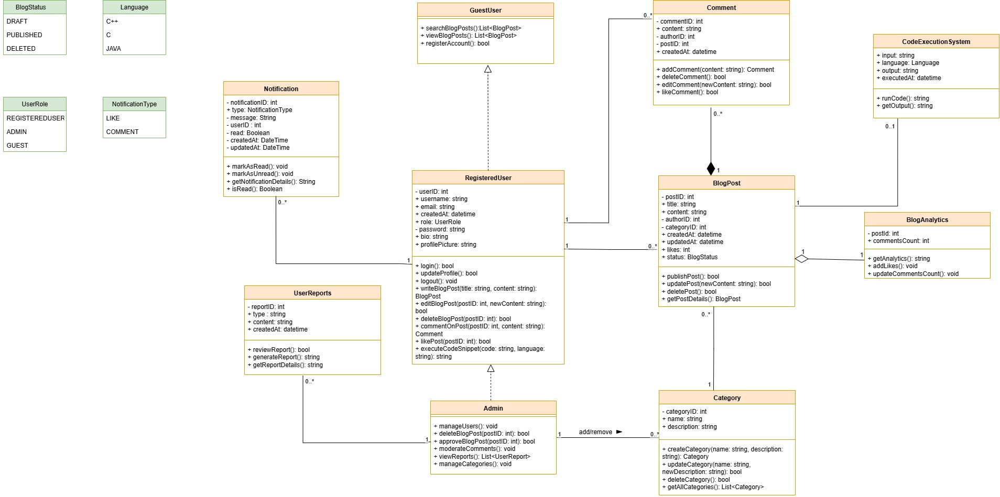

## WriteStack – Design Document

**Members:**

- Harsh Wadhwani - 202412124
- Vitrag Shah - 202412100
- Kunal Agarwal - 202412042
- Anuj Patel - 202412064

### 1. Problem Statement

Tech bloggers and readers often struggle with static, non-interactive platforms that limit engagement and learning. Developers, educators, and coding enthusiasts need a space to create and explore content seamlessly, with features that foster interaction and community. Common pain points include:

- **Inability to run code snippets live**
- **Lack of real-time feedback**
- **Minimal user interaction**

**Solution:**
WriteStack provides a clean, user-friendly MERN stack blogging platform that enables users to create, view, and comment on blogs, fostering discussion and collaboration. The system includes:

- **Live code execution** within blogs (for technical posts)
- **Real-time notifications** for comments and updates
- **Integrated admin panel** for efficient content management and moderation

This innovation makes technical content more engaging and interactive while maintaining support for non-technical blogs.

### 2. Introduction

WriteStack is a modern blogging platform that supports both technical and non-technical content. It allows users to create, edit, publish, and engage with blogs through comments, likes, and notifications. The platform provides role-based access (Guest, Registered User, Admin) and features an integrated analytics module for performance insights.

The system will be implemented using MERN (MongoDB, Express.js, React.js, Node.js) for scalability and real-time updates.

### 3. System Objectives

- **Create and publish** blogs in multiple categories
- **Support live code execution** within blogs for technical content
- **Implement role-based access control**
- **Enable interaction** through comments, likes, and real-time feedback
- **Provide notifications** for comments, likes, and admin alerts
- **Integrate analytics** for blog performance tracking
- **Ensure scalability and extensibility** for future enhancements

### 4. Design Overview

The design follows object-oriented principles and is structured around:

- **Users:** `GuestUser`, `RegisteredUser`, `Admin`
- **Blogs & Related Entities:** `BlogPost`, `Comment`, `Category`
- **Supporting Entities:** `Notification`, `Analytics`
- **Enumerations:** `PostStatus`, `UserRole`, `NotificationType`
- **Architecture:** MERN stack with modular components for UI, API, and database layers

### 5. Class Design

#### 5.1 Blog Hierarchy

- **BlogPost**
  - **Attributes:** `postID`, `title`, `content`, `createdAt`, `updatedAt`, `likes`, `status`
  - **Methods:** `publishPost()`, `updatePost()`, `deletePost()`, `getPostDetails()`

- **Category**
  - **Attributes:** `categoryID`, `name`, `description`
  - **Purpose:** Organizes blogs into categories

- **PostStatus (enum)**
  - **Values:** `DRAFT`, `PUBLISHED`, `DELETED`

#### 5.2 User Hierarchy

- **User (abstract)**
  - **Attributes:** `userID`, `username`, `email`, `createdAt`, `role`
  - **Purpose:** Base class for all user types

- **GuestUser**
  - **Methods:** `browsePosts()`, `searchPosts()`

- **RegisteredUser**
  - **Attributes:** `password`, `bio`, `profilePicture`
  - **Methods:** `createPost()`, `editProfile()`, `commentOnPost()`

- **Admin**
  - **Methods:** `manageUsers()`, `deleteBlogPost()`, `approveBlogPost()`, `moderateComments()`

- **UserRole (enum)**
  - **Values:** `GUEST`, `REGISTERED_USER`, `ADMIN`

#### 5.3 Supporting Entities

- **Comment**
  - **Attributes:** `commentID`, `content`, `createdAt`, `updatedAt`
  - **Methods:** `editComment()`, `deleteComment()`

- **Notification**
  - **Attributes:** `notificationID`, `message`, `read`, `createdAt`, `updatedAt`
  - **Methods:** `markAsRead()`, `getNotificationDetails()`, `isRead()`
  - **Relationships:** Linked to `User`, `BlogPost`, `Comment`

- **NotificationType (enum)**
  - **Values:** `LIKE`, `COMMENT`, `FOLLOW`, `REPLY`, `ADMIN_ALERT`

### 6. Relationships

- **BlogPost ↔ Comment:** 1 to 0..*
- **BlogPost ↔ RegisteredUser (Author):** 1 to 1
- **BlogPost ↔ Category:** 1 to 1
- **RegisteredUser ↔ Comment:** 1 to 0..*
- **Notification ↔ User:** Many-to-One (recipient and sender)
- **Notification ↔ BlogPost:** Optional
- **Notification ↔ Comment:** Optional

### 7. Business Logic Notes

- **Only registered users** can publish blogs and comment
- **Guests** can only browse and search blogs
- **Admins** can manage users, approve or delete posts, and moderate comments
- **Notifications** trigger for likes, comments, and admin alerts
- **Analytics** track likes, comments, and views

### 8. Extensibility

- **Support for tags and filters**
- **AI-based recommendations**
- **Multi-language blog support**
- **Advanced analytics dashboards** for content creators
- **Extend roles** (e.g., Moderator)

### 9. UML Diagram Reference

The UML diagram includes:

- **Classes:** `BlogPost`, `Category`, `Comment`, `Notification`
- **User Hierarchy:** `GuestUser`, `RegisteredUser`, `Admin`
- **Enums:** `PostStatus`, `UserRole`, `NotificationType`
- **Relationships with multiplicities**

---

